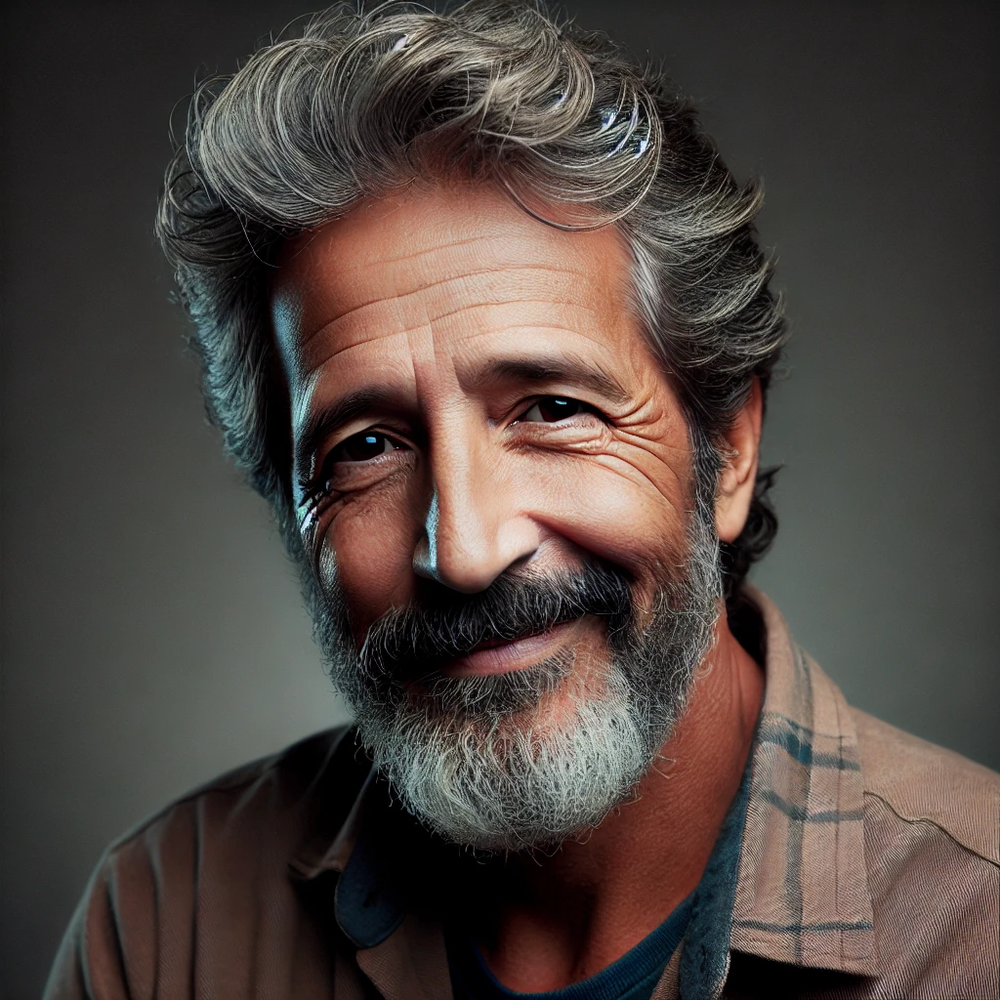
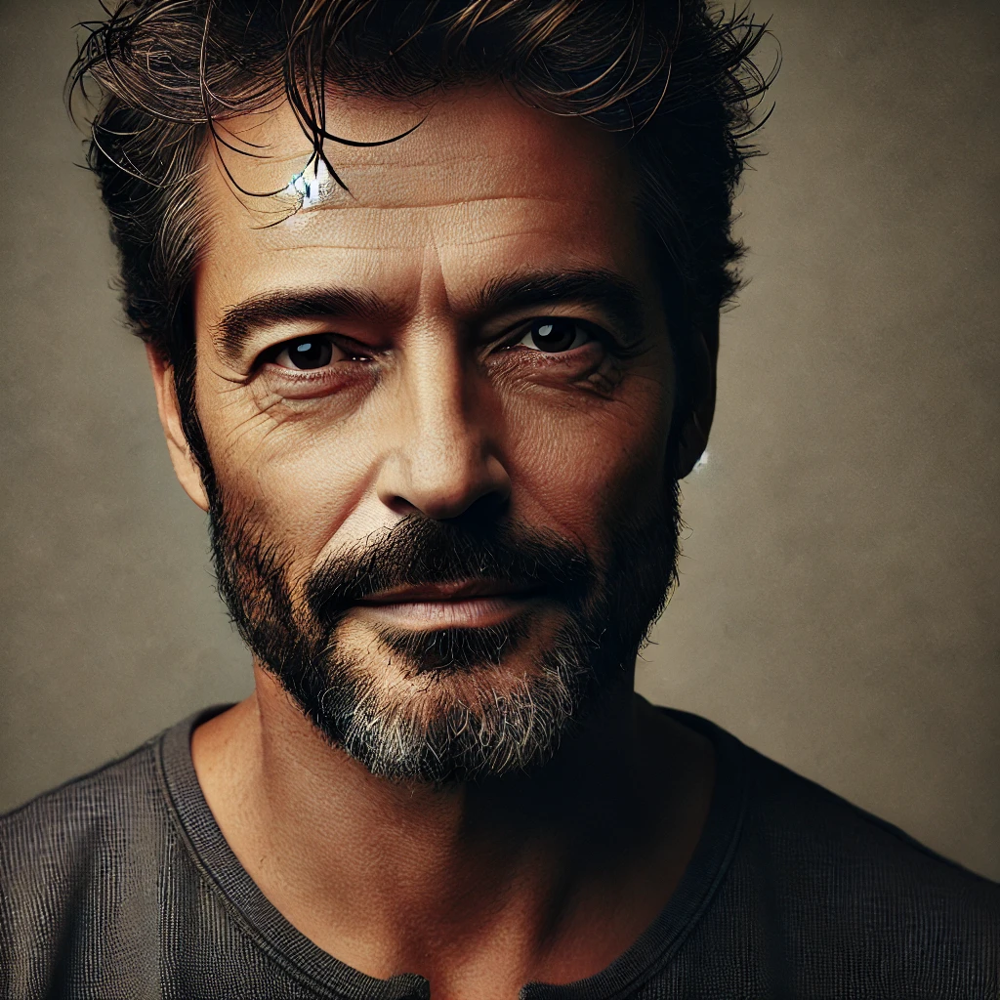

# README - Utilização de Prompt para Geração de Imagens com IA

Este projeto demonstra o uso de prompts para a criação de imagens geradas por IA. Abaixo estão os detalhes do processo e exemplos das etapas realizadas durante a interação para criar representações visuais baseadas em descrições textuais.

## Objetivo
O objetivo foi gerar retratos de um personagem fictício chamado "Senhor Barruga" utilizando descrições detalhadas fornecidas no prompt. Essa abordagem permite explorar o uso de IA para representar visualmente conceitos criados apenas com palavras.

## Etapas do Processo

1. **Definição do personagem:**
   - O personagem, Senhor Barruga, foi descrito com detalhes como idade, altura, peso, tom de pele e traços faciais.
   - Exemplo de descrição inicial:
     - 45 anos, aparentando 50 anos.
     - 1,75 m de altura e 100 kg.
     - Pele parda, traços que misturam características espanholas e malaias.

2. **Primeira geração de imagem:**
   - A descrição foi utilizada como entrada para a IA, gerando um retrato inicial do personagem.
   - Prompt usado:
     ```
     Retrato de um homem chamado Senhor Barruga, aparentando 50 anos, com 45 anos de idade, 1,75 m de altura e pesando 100 quilos. Ele tem pele de cor parda, traços que combinam características espanholas e malaias, com expressão amigável e um leve sorriso. Ele está vestindo uma camisa casual, em um cenário neutro com iluminação suave que destaca sua fisionomia única. Foco nos detalhes do rosto e nas expressões faciais.
     ```
   - Imagem gerada:
     

3. **Atualização e refinamento:**
   - Um ajuste foi solicitado para modificar a aparência do personagem, como a barba feita há três dias e uma idade aparente mais próxima de 48 anos.
   - Novo prompt usado:
     ```
     Retrato de um homem chamado Senhor Barruga, aparentando 48 anos, com 45 anos de idade, 1,75 m de altura e pesando 100 quilos. Ele tem pele de cor parda, traços que combinam características espanholas e malaias, com barba feita há 3 dias, resultando em um leve crescimento de pelos faciais. Ele possui uma expressão amigável e serena, usando uma camisa casual. O cenário é neutro, com iluminação suave que destaca sua fisionomia única e os detalhes faciais.
     ```
   - Imagem gerada:
     

4. **Geração final:**
   - O retrato foi gerado com os ajustes solicitados e apresentado para validação.

## Resultado
O resultado foi uma série de imagens geradas que capturam as descrições fornecidas, mostrando a flexibilidade e o potencial de utilizar IA para criar imagens baseadas em prompts detalhados.

## Considerações Finais

- Este projeto ilustra como a clareza e a riqueza dos detalhes nos prompts influenciam diretamente a qualidade das imagens geradas.
- Aplicações potenciais incluem design de personagens, criação artística e visualização de conceitos em diversas áreas.

## Arquivos
- Imagens geradas estão disponíveis no ambiente utilizado.
- Exemplos de prompts utilizados estão documentados acima.

---
**Criado em colaboração com IA.**
